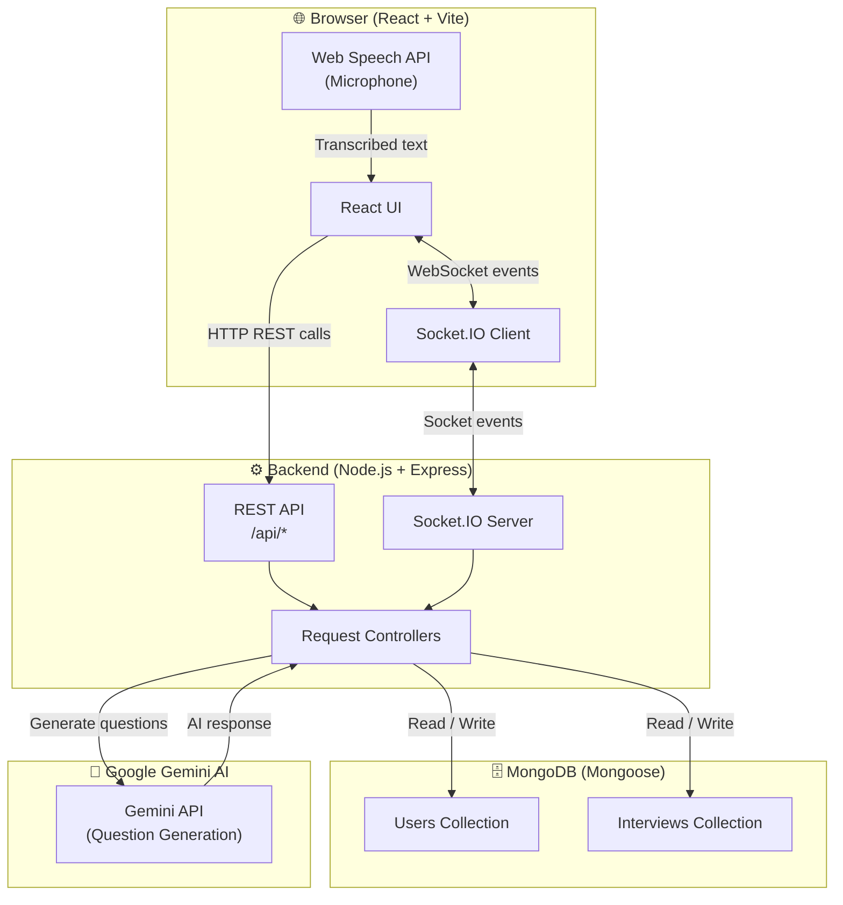
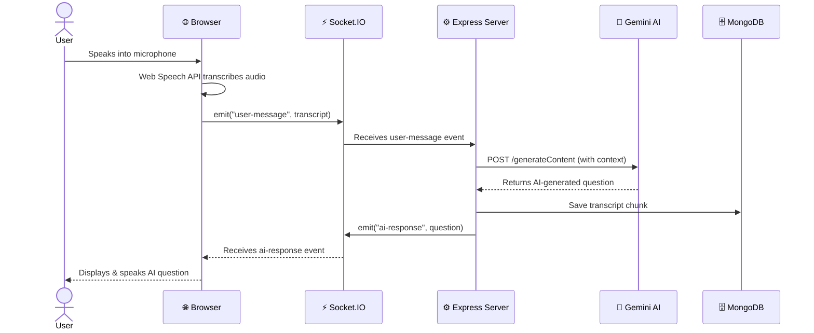
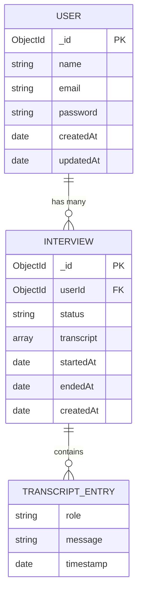
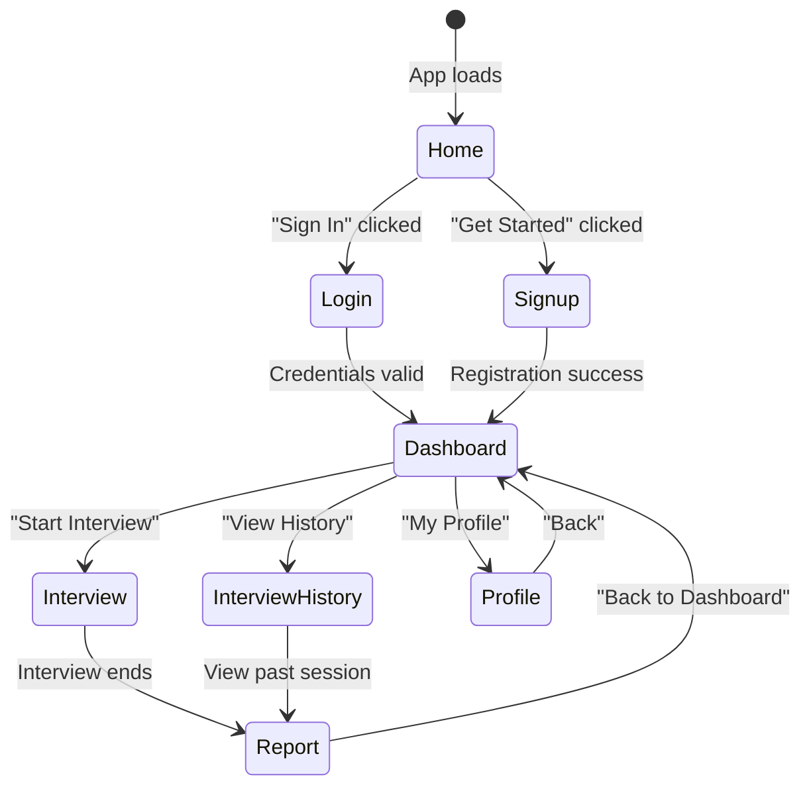
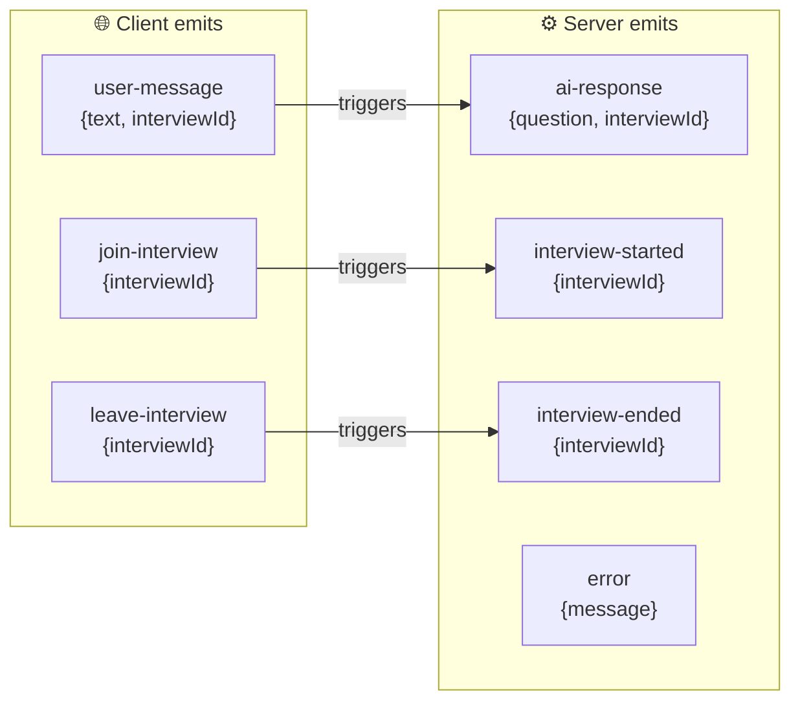
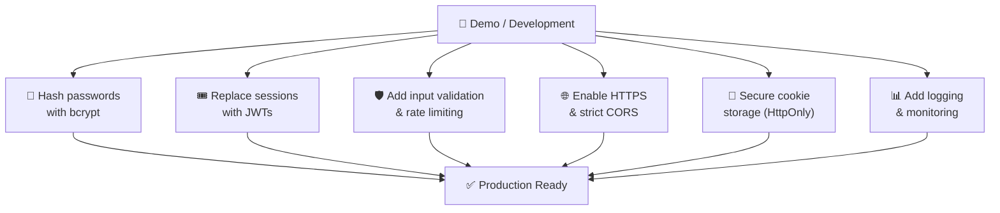

<div align="center">

# 🎙️ AI Interview Practice

**Voice-driven, full-stack interview simulator powered by AI**

[](https://react.dev/)
[](https://vitejs.dev/)
[](https://nodejs.org/)
[](https://www.mongodb.com/)
[](https://socket.io/)
[](https://deepmind.google/technologies/gemini/)
[](LICENSE)
[](https://ai-interviewer-frontend-murex.vercel.app/)

<br/>

> Practice job interviews through real voice conversations with an AI interviewer — anytime, anywhere.

### 🚀 [Live Demo → ai-interviewer-frontend-murex.vercel.app](https://ai-interviewer-frontend-murex.vercel.app/)

</div>

---

## 📋 Table of Contents

- [Overview](#-overview)
- [Live Demo](#-live-demo)
- [System Architecture](#-system-architecture)
- [Tech Stack](#-tech-stack)
- [Project Structure](#-project-structure)
- [Data Models](#-data-models)
- [API Reference](#-api-reference)
- [Socket.IO Events](#-socketio-events)
- [User Flow](#-user-flow)
- [Quick Start](#-quick-start)
- [Environment Variables](#-environment-variables)
- [Available Scripts](#-available-scripts)
- [Security & Production Notes](#-security--production-notes)
- [Troubleshooting](#-troubleshooting)
- [Contributing](#-contributing)
- [Contact & Support](#-contact--support)
- [License](#-license)

---

## 🌟 Overview

**AI Interview Practice** is a full-stack web application that simulates real job interview scenarios using voice input. Users speak naturally into their microphone, and the system transcribes their responses in real time, feeds them to an AI model (Google Gemini), and receives contextually relevant follow-up questions — all streamed live via WebSockets.

### Key Highlights

- 🎤 **Voice-First UX** — Mic capture via the Web Speech API; no third-party transcription fees
- ⚡ **Real-Time Streaming** — Socket.IO keeps question/answer exchange instantaneous
- 🤖 **AI Question Generation** — Google Gemini produces contextual interview questions
- 📜 **Transcript Storage** — Every session is persisted to MongoDB for later review
- 📊 **History & Reports** — Review past interviews with full transcript playback
- 🔒 **Auth Flow** — Signup / login with session management

---

## 🚀 Live Demo

> **Try it now, no setup required!**

| | |
|---|---|
| 🌐 **URL** | [https://ai-interviewer-frontend-murex.vercel.app/](https://ai-interviewer-frontend-murex.vercel.app/) |
| 🖥️ **Hosted on** | Vercel |
| 🎤 **Best experience** | Chrome browser (required for voice recognition) |
| 📋 **To get started** | Sign up → Pick a role → Hit **Start Interview** and speak! |

> ⚠️ Make sure to use **Chrome** and **allow microphone access** when prompted for full voice functionality.

---

## 🏗️ System Architecture

The diagram below shows how the browser, backend, database, and AI service interact end-to-end.



---

## 🔄 Request & Response Lifecycle



---

## 🛠️ Tech Stack

| Layer | Technology | Purpose |
|---|---|---|
| **Frontend** | React 18 + Vite | SPA framework & fast dev server |
| **Styling** | CSS Modules / index.css | Component-scoped styles |
| **Voice** | Web Speech API | In-browser microphone transcription |
| **Real-Time** | Socket.IO (client) | Bidirectional WebSocket communication |
| **Backend** | Node.js + Express | REST API & business logic |
| **WebSockets** | Socket.IO (server) | Real-time event handling |
| **Database** | MongoDB + Mongoose | Persistent data storage |
| **AI** | Google Gemini API | Contextual question generation |
| **Dev Tools** | Nodemon, ESLint | Hot reload & linting |

---

## 📁 Project Structure

```
AI-Interviewer-main/
│
├── 📄 README.md                  ← You are here
├── 📄 QUICKSTART.md              ← Abbreviated setup guide
├── 📄 .gitignore
│
├── 🖥️ backend/
│   ├── server.js                 ← Express app + Socket.IO server
│   ├── package.json
│   ├── .env                      ← Environment variables (not committed)
│   └── models/
│       ├── User.js               ← Mongoose User model
│       └── Interview.js          ← Mongoose Interview/transcript model
│
└── 🌐 frontend/
    ├── index.html                ← Vite HTML entry point
    ├── vite.config.js            ← Vite configuration
    ├── package.json
    ├── .env                      ← Frontend env variables (not committed)
    └── src/
        ├── main.jsx              ← React entry point
        ├── App.jsx               ← Root component + routing
        ├── config.js             ← Shared config (API URL, etc.)
        ├── index.css             ← Global styles
        └── pages/
            ├── Home.jsx          ← Landing / welcome page
            ├── Login.jsx         ← User login
            ├── Signup.jsx        ← User registration
            ├── Dashboard.jsx     ← Post-login dashboard
            ├── Interview.jsx     ← Live interview session (voice + Socket.IO)
            ├── InterviewHistory.jsx ← Past sessions list
            ├── Report.jsx        ← Detailed session report
            └── Profile.jsx       ← User profile management
```

---

## 🗃️ Data Models



---

## 🗺️ Frontend Page Flow



---

## 🔌 API Reference

### Authentication

| Method | Endpoint | Description | Body |
|--------|----------|-------------|------|
| `POST` | `/api/signup` | Register a new user | `{ name, email, password }` |
| `POST` | `/api/login` | Authenticate user | `{ email, password }` |

### Interviews

| Method | Endpoint | Description | Auth |
|--------|----------|-------------|------|
| `POST` | `/api/interview/start` | Create a new interview session | ✅ |
| `POST` | `/api/interview/stop/:interviewId` | End and save a session | ✅ |
| `GET` | `/api/interview/history` | Fetch all past interviews | ✅ |
| `GET` | `/api/interview/:interviewId` | Fetch a single interview | ✅ |

### User

| Method | Endpoint | Description | Auth |
|--------|----------|-------------|------|
| `GET` | `/api/user/profile` | Get current user profile | ✅ |
| `PUT` | `/api/user/profile` | Update user profile | ✅ |

---

## ⚡ Socket.IO Events



| Event | Direction | Payload | Description |
|-------|-----------|---------|-------------|
| `join-interview` | Client → Server | `{ interviewId }` | Join a session room |
| `user-message` | Client → Server | `{ text, interviewId }` | Send transcribed answer |
| `leave-interview` | Client → Server | `{ interviewId }` | Leave the room |
| `ai-response` | Server → Client | `{ question, interviewId }` | Broadcast AI question |
| `interview-started` | Server → Client | `{ interviewId }` | Confirm session started |
| `interview-ended` | Server → Client | `{ interviewId }` | Confirm session ended |
| `error` | Server → Client | `{ message }` | Error notification |

---

## 🚀 Quick Start

### Prerequisites

Make sure you have the following installed:

- [Node.js](https://nodejs.org/) **v18+**
- [npm](https://www.npmjs.com/) **v9+**
- [MongoDB](https://www.mongodb.com/) (local) **or** a [MongoDB Atlas](https://www.mongodb.com/atlas) URI
- Chrome / Chromium browser (required for Web Speech API)

---

### 1. Clone the Repository

```bash
git clone https://github.com/Sanjaymo/AI-Powered-Interview-and-Analysis.git
cd AI-Interviewer-main
```

---

### 2. Backend Setup

```bash
cd backend
npm install
```

Create a `.env` file inside `backend/`:

```env
PORT=5000
MONGODB_URI=mongodb://localhost:27017/ai-interviewer
GEMINI_API_KEY=your_gemini_api_key_here   # optional
```

Start the backend dev server:

```bash
npm run dev
```

> The backend will start on **http://localhost:5000**

---

### 3. Frontend Setup

Open a new terminal:

```bash
cd frontend
npm install
npm run dev
```

> The frontend will be available at **http://localhost:5173** (or 5174)

---

### 4. Open in Browser

Navigate to `http://localhost:5173`, create an account, and start your first interview!

> ⚠️ **Voice recognition requires Chrome** on `localhost` or an HTTPS domain.

---

## 🔐 Environment Variables

### Backend (`backend/.env`)

| Variable | Required | Default | Description |
|----------|----------|---------|-------------|
| `PORT` | No | `5000` | Express server port |
| `MONGODB_URI` | ✅ Yes | — | MongoDB connection string |
| `GEMINI_API_KEY` | No | — | Google Gemini API key for AI questions |

### Frontend (`frontend/.env`)

| Variable | Required | Default | Description |
|----------|----------|---------|-------------|
| `VITE_API_URL` | No | `http://localhost:5000` | Backend API base URL |
| `VITE_SOCKET_URL` | No | `http://localhost:5000` | Socket.IO server URL |

---

## 📜 Available Scripts

### Backend

```bash
cd backend

npm run dev       # Start with nodemon (hot reload)
npm start         # Start for production
```

### Frontend

```bash
cd frontend

npm run dev       # Vite dev server with HMR
npm run build     # Production build → dist/
npm run preview   # Preview the production build locally
```

---

## 🔒 Security & Production Notes

> ⚠️ This project is a **demo/prototype**. Before deploying to production, implement the following:



---

## 🔧 Troubleshooting

| Problem | Cause | Fix |
|---------|-------|-----|
| `MongoServerError: connect ECONNREFUSED` | MongoDB not running | Run `mongod` locally or check Atlas URI |
| `Port 5000 already in use` | Another process on port 5000 | Change `PORT` in `backend/.env` |
| `CORS error in browser` | Backend CORS misconfigured | Ensure `cors()` middleware is enabled with correct origin |
| `Speech recognition not working` | Wrong browser or HTTP | Use **Chrome** on `localhost` or HTTPS |
| `Gemini API errors` | Missing or invalid key | Set `GEMINI_API_KEY` in `backend/.env` |
| `Socket not connecting` | Wrong `VITE_SOCKET_URL` | Verify frontend `.env` points to backend port |

---

## 🤝 Contributing

Contributions are welcome! Here's how:

1. **Fork** the repository
2. Create a **feature branch** — `git checkout -b feature/your-feature-name`
3. **Commit** your changes — `git commit -m "feat: add your feature"`
4. **Push** the branch — `git push origin feature/your-feature-name`
5. Open a **Pull Request**

Please keep PRs small and focused. Describe what your change does and why.

---

## 📬 Contact & Support

Built and maintained by **Sanjay Choudhari**

| Platform | Link |
|----------|------|
| 📧 Email | [sanjaychoudhari288@gmail.com](mailto:sanjaychoudhari288@gmail.com) |
| 📱 Phone | [+91 9963785768](tel:+919963785768) |
| 💼 LinkedIn | [linkedin.com/in/sanjaychoudhari09](https://www.linkedin.com/in/sanjaychoudhari09/) |
| 🐙 GitHub | [github.com/Sanjaymo](https://github.com/Sanjaymo) |
| 🌐 Portfolio | [sanjaymo.github.io](https://sanjaymo.github.io) |

> Feel free to reach out for questions, suggestions, or collaboration!

---

## 📄 License

This project is licensed under the **MIT License** — see the [LICENSE](LICENSE) file for details.

```
MIT License — Copyright (c) 2024 Sanjay Choudhari
Permission is hereby granted, free of charge, to any person obtaining a copy
of this software to use, copy, modify, merge, publish, distribute, sublicense,
and/or sell copies of the Software...
```

---

<div align="center">

**If you found this project helpful, please ⭐ star the repo!**

Made with ❤️ by [Sanjay Choudhari](https://sanjaymo.github.io)

</div>
